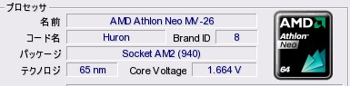
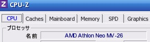

# haturatu PC Memories (2012-2016 / XP → Win7)

Windows XP から Windows 7 への移行期 (2012-2016) の個人的なデータアーカイブ。

色々なつかしいものがでてくるものです。。。  
当時

## 目次 (アクセスマップ)

| ディレクトリ | 内容 | README |
|---|---|---|
| [`bookmark/`](bookmark/) | ブックマーク抽出済み一覧 (URL重複排除) | [`bookmark/README.md`](bookmark/README.md) |
| [`xp-sreenshot/`](xp-sreenshot/) | XP 時代のスクリーンショット集 | [`xp-sreenshot/README.md`](xp-sreenshot/README.md) |
| [`music/`](music/) | ログから聞いてたと思われる曲一覧 (曲名・アーティスト・登録日時) | [`music/README.md`](music/README.md) |
| [`homepage/`](homepage/) | XP 時代に作った個人ホームページ (HTML) | [`homepage/README.md`](homepage/README.md) |
| [`use-freesoft/`](use-freesoft/) | 当時の USB に保存していたフリーソフト一覧 | [`use-freesoft/README.md`](use-freesoft/README.md) |

## 各セクションへのリンク

- **ブックマーク** — [`bookmark/README.md`](bookmark/README.md)
  - 日付・リンク・タイトルを抽出し、URL重複は最初のものを保持。文字エンコードは全て UTF-8 化。
- **スクリーンショット** — [`xp-sreenshot/README.md`](xp-sreenshot/README.md)
  - タイムスタンプと画像へのリンクを時系列で一覧化。
- **音楽** — [`music/README.md`](music/README.md)
  - ログで確認できた楽曲を曲名・アーティスト・登録日時で一覧化。
- **ホームページ** — [`homepage/README.md`](homepage/README.md)
  - XP 時代に作成した個人ホームページの HTML ファイル類。
- **フリーソフト** — [`use-freesoft/README.md`](use-freesoft/README.md)
  - USB メモリに保存していたフリーソフト (83 ディレクトリ / 467 ファイル) をカテゴリ別に一覧化。
